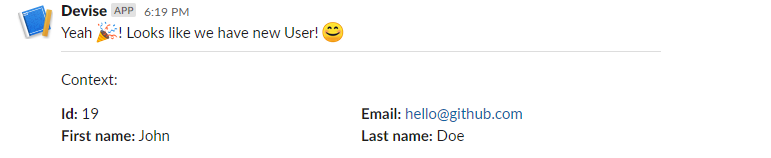
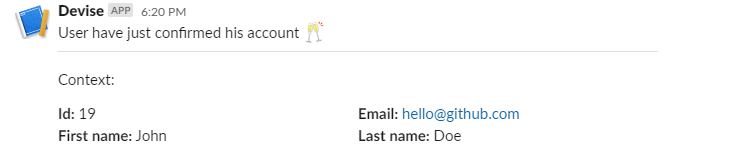

# DeviseSlackNotifiable

Devise slack notifications gem. It posts message after registration and confirmation (if Devise confirmations strategy is enabled).

## Installation

Add this line to your application's Gemfile:

```ruby
gem 'devise_slack_notifiable'
```

And then execute:

    $ bundle install

Or install it yourself as:

    $ gem install devise_slack_notifiable

## Usage

### 1. Slack
Prepare Slack Webhook - it should look like `https://hooks.slack.com/services/XXX/XXX/XXX`.

Not sure how to do that? Check out [slack documentation](https://api.slack.com/messaging/webhooks#getting_started).

### 2. Application
After preparing Slack Webhook create initializer - `config/initializers/devise_slack_notifiable.rb`:
```ruby
DeviseSlackNotifiable.configure do |config|
  # Enabled state
  #   By default integration is disabled. You need to enable it manually on desired environments.
  #   For example production only:
  #   config.enabled = Rails.env.production?
  config.enabled = true

  # Slack Webhook URL
  #   Required when integration enabled.
  #   It's recommended to use rails credentials instead of raw url (https://edgeguides.rubyonrails.org/security.html#custom-credentials)
  config.slack_webhook = 'YOUR_SLACK_WEBHOOK_URL'
end
```

After creating initializer add `:slack_notifiable` to the devise call in your model (we’re assuming here you already have a User model with some Devise modules):
```ruby
class User < ActiveRecord::Base
  devise :database_authenticatable, :confirmable, :slack_notifiable
end
```

And you are ready to go!

## Messages
Messages overview:




### Customization

#### Context
If You want to add more fields to context check out configuration in initializer - it's based on `context_fields`.

Example with context extended by first and last name (as on screenshots):
```ruby
config.context_fields = [:id, :email, :first_name, :last_name]
```

#### Sending own messages
TODO!

#### Message formatting
You can customize messages by initializer:
```ruby
config.registration_message_formatter = lambda { |entity|
                                          "Yeah 🎉! Looks like we have new #{entity.model_name.human}! 😊"
                                        }
```

```ruby
config.confirmation_message_formatter = lambda { |entity|
                                          "#{entity.model_name.human} have just confirmed his account 🥂"
                                        }
```

## Development

After checking out the repo, run `bin/setup` to install dependencies. Then, run `rake spec` to run the tests. You can also run `bin/console` for an interactive prompt that will allow you to experiment.

To install this gem onto your local machine, run `bundle exec rake install`. To release a new version, update the version number in `version.rb`, and then run `bundle exec rake release`, which will create a git tag for the version, push git commits and tags, and push the `.gem` file to [rubygems.org](https://rubygems.org).

## Contributing

Bug reports and pull requests are welcome on GitHub at https://github.com/invoicity/devise_slack_notifiable. This project is intended to be a safe, welcoming space for collaboration, and contributors are expected to adhere to the [code of conduct](https://github.com/invoicity/devise_slack_notifiable/blob/master/CODE_OF_CONDUCT.md).


## License

The gem is available as open source under the terms of the [MIT License](https://opensource.org/licenses/MIT).

## Code of Conduct

Everyone interacting in the DeviseSlackNotifiable project's codebases, issue trackers, chat rooms and mailing lists is expected to follow the [code of conduct](https://github.com/[USERNAME]/devise_slack_notifiable/blob/master/CODE_OF_CONDUCT.md).
